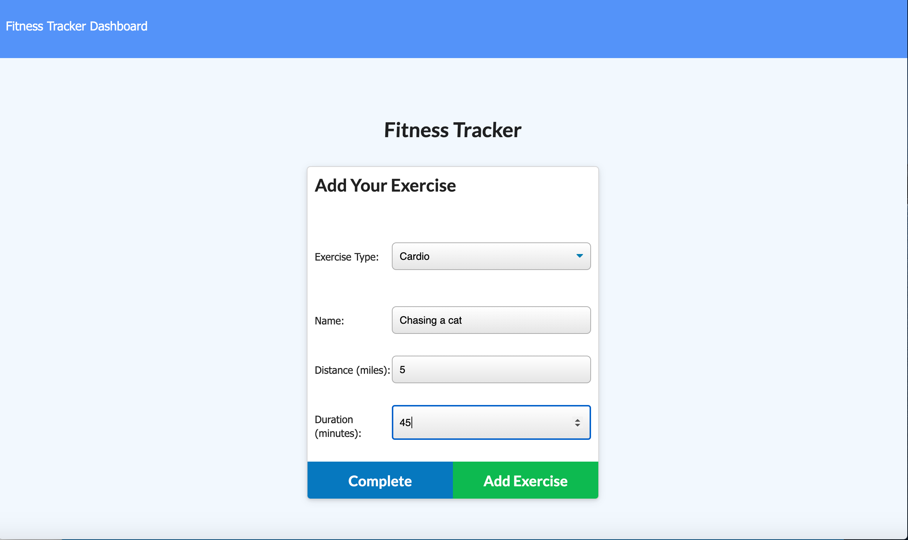
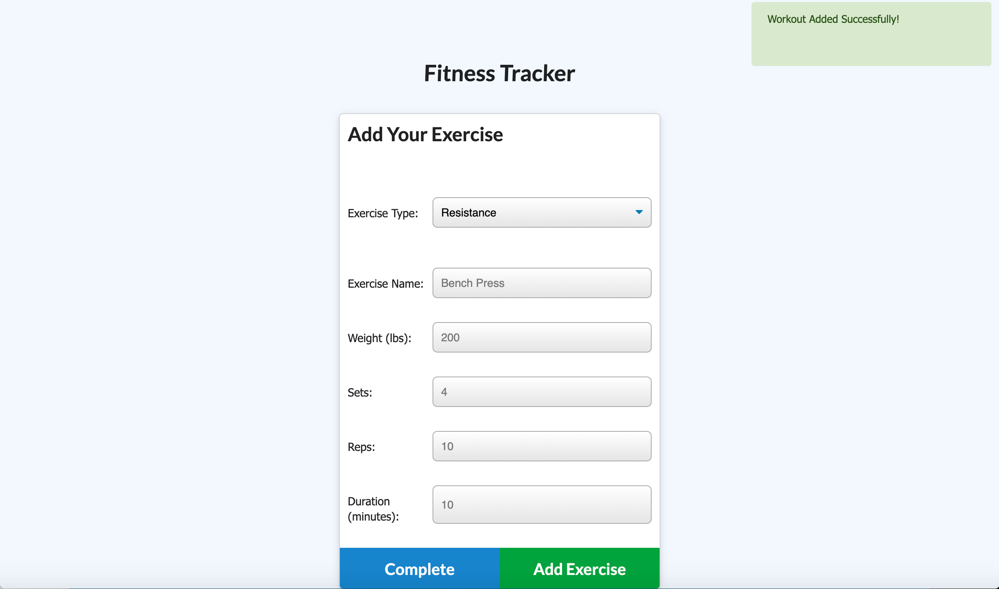
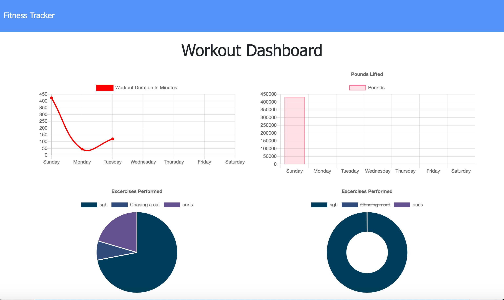

# workout-tracker

## Description

Create a workout tracker with a functional database usiong mongoDB and mongoose. User should be able to add exercises to a previous workout plan, add new exercises to a new workout plan, and view combined weight of multiple exercies on the 'stats' page.

## User Story

As a user, I want to be able to view create and track daily workouts. I want to be able to log multiple exercises in a workout on a given day. I should also be able to track the name, type, weight, sets, reps, and duration of exercise. If the exercise is a cardio exercise, I should be able to track my distance traveled.

## Sreen Shots

## Built With

- Express
- MongoDB
- Mongoose
- Morgan
- JSON
- Javascript
- CSS
- HTML

## Deployed Link

## Author

### Ry Hull
- https://github.com/ryandelonhull
- https://Linkedin.com/in/ryan-hull-94003144
- https://ryandelonhull.github.io/Bootstrap-Portfolio/

## *Acknowledgments*

Big thank you to my classmates for helping each other out with questions and finding answers through working together. A last big shout out to Jerome, Roger, Kerwin, and Miguel, and my tutor for steering me in the right direction and showing me true north when i am lost in the wilderness.